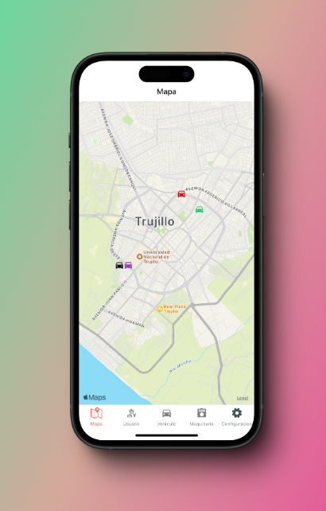

# Aplication Gps Tracking with Expo Go

## Description

This application is a dynamic mobile app built with Expo, leveraging the power of several key libraries to create a seamless and interactive user experience. The app uses React Navigation to enable smooth and intuitive navigation across different screens, ensuring users can easily explore various features.

React Native Maps is integrated to provide real-time, interactive maps, allowing users to visualize locations and track movements directly within the app. This is particularly useful for location-based services or displaying geographic data.

The app also incorporates React Native Reanimated to bring animations to life, providing a highly responsive and fluid interface. This ensures a polished user experience, with transitions and interactions that feel natural and engaging.

To facilitate real-time communication and data synchronization, the app utilizes Socket.IO Client. This allows for instant updates and interaction between the client and the server, making it ideal for real-time features such as live tracking, chat applications, or any other scenario where real-time data flow is essential.

## Installation and Setup

### Prerequisites

- Node.js: Ensure you have Node.js installed (version 14.x or later).
- Expo CLI: Install the Expo CLI globally using npm install -g expo-cli.
- Google Maps API Key: Obtain a Google Maps API Key to use the map functionalities provided by     react-native-maps.
- Backend Server with Socket.IO: If your app uses a server for real-time communication, ensure you have a backend server set up with Socket.IO.

### Installation Steps

1. Clone the repository: `git clone https://github.com/xeppadev/-app_gps_tracker_expo_go.git`
2. Install dependencies: `npm install`
3. Start the application: `expo start`

## Project Structure

```plaintext
Gps-Tracking/
├── assets/                 # Static assets like images, fonts, etc.
│   ├── images/
│   ├── fonts/
│   └── ...
├── components/             # Reusable components used across the app
│   ├── Header.js
│   ├── MapComponent.js
│   ├── RealTimeDataDisplay.js
│   └── ...
├── hooks/                  # Custom hooks, including WebSocket connection
│   ├── useWebSocket.js
│   └── ...
├── App.js                  # Entry point of the application
├── app.json                # Expo configuration file
├── package.json            # Project dependencies and scripts
├── babel.config.js         # Babel configuration for Expo
└── node_modules/           # Installed Node.js dependencies

```

## Screenshots


